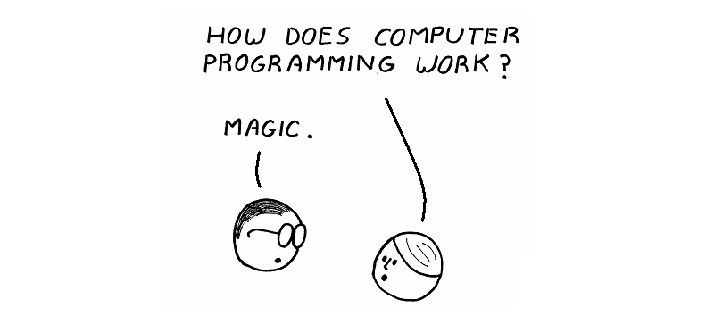

# Assembly programming

[![CC BY-NC-SA 4.0][cc-by-nc-sa-shield]][cc-by-nc-sa]       

This repository contains blog posts that introduce the [assembly](https://en.wikipedia.org/wiki/Assembly_language) programming language. For this moment, all the content and examples cover only the [x86_64](https://en.wikipedia.org/wiki/X86-64) processors and the GNU Linux operating system. In the future, I plan to post learning materials for the [ARM64](https://en.wikipedia.org/wiki/AArch64) architecture.

Whether you are an experienced programmer or not, these posts are intended for everyone to learn the assembly programming language. The posts cover the following topics:

- Basic description of the x86_64 processor architecture
- How to write, build, and run a simple program written in the assembly programming language
- The main parts of which a program for Linux consists
- Basics of memory allocation, what is stack and heap
- What is a system call and how does your program interact with an operating system
- How floating point numbers are represented in a computer memory
- How to call assembly code from a C program
- And many more...

Have fun!

Here are links to each post:

  * [Say hello to x86_64 Assembly part 1](https://github.com/0xAX/asm/blob/master/content/asm_1.md)
  * [Say hello to x86_64 Assembly part 2](https://github.com/0xAX/asm/blob/master/content/asm_2.md)
  * [Say hello to x86_64 Assembly part 3](https://github.com/0xAX/asm/blob/master/content/asm_3.md)
  * [Say hello to x86_64 Assembly part 4](https://github.com/0xAX/asm/blob/master/content/asm_4.md)
  * [Say hello to x86_64 Assembly part 5](https://github.com/0xAX/asm/blob/master/content/asm_5.md)
  * [Say hello to x86_64 Assembly part 6](https://github.com/0xAX/asm/blob/master/content/asm_6.md)
  * [Say hello to x86_64 Assembly part 7](https://github.com/0xAX/asm/blob/master/content/asm_7.md)
  * [Say hello to x86_64 Assembly part 8](https://github.com/0xAX/asm/blob/master/content/asm_8.md)

## Requirements

To run code examples, you need the following tools:

- [64-bit distribution of Linux](https://en.wikipedia.org/wiki/Linux_distribution)
- [make](https://www.gnu.org/software/make/)
- [NASM](https://nasm.us/)
- [binutils](https://www.gnu.org/software/binutils/)

## Translations

Thanks to the volunteers, the posts about assembly programming are translated into different languages.

> [!NOTE] 
> The translations may diverge from the original content.

### Chinese translation

  * [译文: Say hello to x64 Assembly [part 1]](https://github.com/time-river/vvl.me/blob/master/source/_posts/translation-Say-hello-to-x64-Assembly-part-1.md)
  * [译文: Say hello to x64 Assembly [part 2]](https://github.com/time-river/vvl.me/blob/master/source/_posts/translation-Say-hello-to-x64-Assembly-part-2.md)
  * [译文: Say hello to x64 Assembly [part 3]](https://github.com/time-river/vvl.me/blob/master/source/_posts/translation-Say-hello-to-x64-Assembly-part-3.md)
  * [译文: Say hello to x64 Assembly [part 4]](https://github.com/time-river/vvl.me/blob/master/source/_posts/translation-Say-hello-to-x64-Assembly-part-4.md)
  * [译文: Say hello to x64 Assembly [part 5]](https://github.com/time-river/vvl.me/blob/master/source/_posts/translation-Say-hello-to-x64-Assembly-part-5.md)
  * [译文: Say hello to x64 Assembly [part 6]](https://github.com/time-river/vvl.me/blob/master/source/_posts/translation-Say-hello-to-x64-Assembly-part-6.md)
  * [译文: Say hello to x64 Assembly [part 7]](https://github.com/time-river/vvl.me/blob/master/source/_posts/translation-Say-hello-to-x64-Assembly-part-7.md)
  * [译文: Say hello to x64 Assembly [part 8]](https://github.com/time-river/vvl.me/blob/master/source/_posts/translation-Say-hello-to-x64-Assembly-part-8.md)

### Turkish translation

  * [X86_64 Assembly'a merhaba deyin bölüm 1](https://github.com/furkanonder/asm/blob/master/bolumler/1.md)
  * [X86_64 Assembly'a merhaba deyin bölüm 2](https://github.com/furkanonder/asm/blob/master/bolumler/2.md)
  * [X86_64 Assembly'a merhaba deyin bölüm 3](https://github.com/furkanonder/asm/blob/master/bolumler/3.md)
  * [X86_64 Assembly'a merhaba deyin bölüm 4](https://github.com/furkanonder/asm/blob/master/bolumler/4.md)
  * [X86_64 Assembly'a merhaba deyin bölüm 5](https://github.com/furkanonder/asm/blob/master/bolumler/5.md)
  * [X86_64 Assembly'a merhaba deyin bölüm 6](https://github.com/furkanonder/asm/blob/master/bolumler/6.md)
  * [X86_64 Assembly'a merhaba deyin bölüm 7](https://github.com/furkanonder/asm/blob/master/bolumler/7.md)
  * [X86_64 Assembly'a merhaba deyin bölüm 8](https://github.com/furkanonder/asm/blob/master/bolumler/8.md)

### Korean translation

  * [X86_64 어셈블리와 친해지기 [파트 1]](https://github.com/maldron0309/asm/blob/master/ko_doc/post/ko_asm_1.md)
  * [X86_64 어셈블리와 친해지기 [파트 2]](https://github.com/maldron0309/asm/blob/master/ko_doc/post/ko_asm_2.md)
  * [X86_64 어셈블리와 친해지기 [파트 3]](https://github.com/maldron0309/asm/blob/master/ko_doc/post/ko_asm_3.md)
  * [X86_64 어셈블리와 친해지기 [파트 4]](https://github.com/maldron0309/asm/blob/master/ko_doc/post/ko_asm_4.md)
  * [X86_64 어셈블리와 친해지기 [파트 5]](https://github.com/maldron0309/asm/blob/master/ko_doc/post/ko_asm_5.md)
  * [X86_64 어셈블리와 친해지기 [파트 6]](https://github.com/maldron0309/asm/blob/master/ko_doc/post/ko_asm_6.md)
  * [X86_64 어셈블리와 친해지기 [파트 7]](https://github.com/maldron0309/asm/blob/master/ko_doc/post/ko_asm_7.md)
  * [X86_64 어셈블리와 친해지기 [파트 8]](https://github.com/maldron0309/asm/blob/master/ko_doc/post/ko_asm_8.md)

## Contribution 

Read the [Contribution guide](./CONTRIBUTING.md) to learn how to contribute to the project. When contributing, make sure to follow the [Code of Conduct](./CODE_OF_CONDUCT.md).

## License

Each Markdown file in the repository is licensed under the
[Creative Commons Attribution-NonCommercial-ShareAlike 4.0 International License][cc-by-nc-sa].

[![CC BY-NC-SA 4.0][cc-by-nc-sa-image]][cc-by-nc-sa]

[cc-by-nc-sa]: https://creativecommons.org/licenses/by-nc-sa/4.0/
[cc-by-nc-sa-image]: https://licensebuttons.net/l/by-nc-sa/4.0/88x31.png
[cc-by-nc-sa-shield]: https://img.shields.io/badge/License-CC%20BY--NC--SA%204.0-lightgrey.svg

## Author

The technical content is written by [@0xAX](https://x.com/0xAX).

Additional big thanks to [@klaudiagrz](https://github.com/klaudiagrz) for text improvements.
