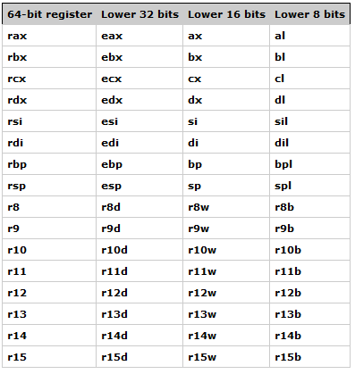

# Introduction to assembly

Hello! Welcome to our short series of posts about the [assembly](https://en.wikipedia.org/wiki/Assembly_language) programming language.

Are you a software developer curious about low-level programming? If so, you're in the right place! If you're just starting to learn programming, assembly might not be the best place to begin. But if you’re already familiar with concepts like hexadecimal numbers, pointers, and boolean logic, have some command-line experience, and know at least one high-level programming language, then you’re ready to dive in.

Even though most of us don’t use assembly daily, understanding it can be incredibly valuable. It gives you insight into how computers really work and can deepen your understanding of the software you write. Think of it as peeking under the hood of the tools you use every day.

In our daily work, we don’t usually write sorting algorithms or string reversal functions manually — we rely on high-level languages, libraries, and frameworks. But have you ever wondered what happens behind the scenes when you write even the simplest code? Let’s start with a basic example:

```C
#include <stdio.h>

int main() {
  int x = 10;
  int y = 100;

  printf("x + y = %d\n", x + y);

  return 0;
}
```

Each of us can understand what this simple piece of C code does. But have you ever thought about how it works at a low level? What does the compiler do with this code? How does the computer load and execute the resulting program? These questions have always interested me, and I suspect I’m not alone. Sure, I can write code in high-level languages like Rust, Erlang, or Go — but what’s really happening behind the scenes?

I first encountered assembly language at university. Back then, I used an old compiler called [Turbo Assembler](https://en.wikipedia.org/wiki/Turbo_Assembler) for some basic exercises. To be honest, I didn’t fully understand what I was doing. Like many students, I just copied code snippets from classmates to get through the assignments. Years passed after graduation, and I’ve spent most of my professional life writing high-level code. Yet, these questions about the low-level workings of my programs kept resurfacing.

Driven by curiosity, I decided to revisit assembly. My goal is to share what I’ve learned and document my journey.

Some might argue that learning assembly is unnecessary or that compilers can often generate better assembly code than a human can write. While this is true to some extent, my interest isn’t purely practical — it’s driven by a desire to understand. Plus, assembly is still used in modern software development. Here are a few notable projects where assembly plays a critical role:

- [Crypto code in OpenSSL](https://github.com/openssl/openssl/tree/master/crypto/sha/asm)
- [FFmpeg codec library](https://github.com/FFmpeg/FFmpeg/tree/master/libavcodec/x86)
- [Linux kernel code](https://github.com/torvalds/linux/blob/master/arch/x86/kernel/head_64.S)
- [Browser engines](https://github.com/mozilla/gecko-dev/tree/master/gfx/cairo/libpixman/src)
- [OpenCV Hardware Acceleration Layer](https://github.com/opencv/opencv/tree/master/modules/core/include/opencv2/core/hal)

So, let's start.

## Preparations

Every start needs preparations. This series of posts focuses on assembly programming for the [x86_64](https://en.wikipedia.org/wiki/X86-64) architecture using the [Linux](https://en.wikipedia.org/wiki/Linux) operating system. To follow along, you’ll need a machine with an x86_64 CPU and a [Linux distribution](https://en.wikipedia.org/wiki/Linux_distribution) installed.

In addition to a Linux machine, you’ll need compilers to build the examples we’ll explore. We’ll mostly use these two compilers for C and assembly examples:

- [GNU GCC](https://gcc.gnu.org/)
- [NASM](https://nasm.us/)
- [GNU LD](https://sourceware.org/binutils/docs/ld/)

We will use these three tools in most of the examples. If we need additional tools, I’ll mention them in the relevant example descriptions. You can install GNU GCC, NASM, and GNU LD using your Linux distribution’s package manager. For [Debian](https://www.debian.org/)-based distributions, use:

```bash
sudo apt-get install gcc nasm binutils
```

For RPM-based distributions, use:

```bash
sudo dnf install gcc nasm binutils
```

For other Linux distributions, refer to their documentation to learn how to install packages.

Once you’ve installed and configured these tools, there’s one last thing you’ll need: a text editor to write your assembly code. The choice of editor is entirely up to you. Personally, I use [GNU Emacs](https://www.gnu.org/software/emacs/) with [nasm-mode](https://github.com/skeeto/nasm-mode) for assembly development. However, this is not mandatory — feel free to use any editor you’re comfortable with.

If you’re using Emacs, you can install `nasm-mode` and configure it with:

```elisp
(load "~/.emacs.d/lisp/nasm.el")

(require 'nasm-mode)
(add-to-list 'auto-mode-alist '("\\.\\(asm\\|s\\|S\\)$" . nasm-mode))
```

With these tools and environment ready, let’s get started!

## Basics of NASM assembly syntax

Here, we won’t dive into the full syntax of the assembly programming language. Instead, we’ll cover just enough to build and run our first example without diving too deep into the complexities of assembly or the `x86_64` CPU architecture. And what better way to start than with the classic ["Hello, World!"](https://en.wikipedia.org/wiki/%22Hello,_World!%22_program) program?

Code usually consists of two main elements: the code itself and comments. Comments in assembly start with the `;` symbol. Code is usually divided into sections (also called memory segments), with each section containing specific types of data. For our "Hello, World!" program, we’ll need just two sections:

-  `data` section
-  `text` section

The `data` section is used to declare static data with lifetime equal to the program's lifetime. To define the `data` section, use the following syntax:

```assembly
;; Definition of the data section
section .data
```

The `text` section contains instructions for the program. Every program is a set of instructions that tell the computer how to perform a specific task. The assembly program is no different. But before a computer starts to execute a program, it should know where to start from. The beginning of the execution starts from the program's [entry point](https://en.wikipedia.org/wiki/Entry_point). The name of such entry point is usually `_start`. The entry point is set by a special program called **linker** during the building process of a program. The building of a source code to a ready-to-run program consists of two parts:

- Compilation to an [object file](https://en.wikipedia.org/wiki/Object_file).
- Building an executable from the object files with a [linker](https://en.wikipedia.org/wiki/Linker_(computing)).

A linker sets the entry point in the resulted executable file. That is why we must specify the entry point in the `text` section of our program so that the linker can find it. The entry point symbol must be defined as `global` so that the symbol `_start` is visible to the linker.

See the example:

```assembly
;; Definition of the text section
section .text

;; Mark the `_start` symbol as global so that it is visible to the linker
global _start

;; Definition of the program entry point
_start:
```

> [!NOTE]
> You don't have to name the entry point `_start`. You can overwrite it using the `-e <symbol-name>` option of the [GNU ld linker](https://sourceware.org/binutils/docs/ld/), but we will not use this option in our programs.

Now that we know how to define the basic sections of our first assembly program, we can look at the first instructions.

Every NASM assembly source code line contains some combination of the following four fields:

```
[label:] instruction [operands] [; comment]
```

Fields specified in square brackets are optional. A basic `instruction` usually consists of two parts:

- Name of the instruction
- Optional operands of the instruction

If you already have experience with one of the high-level programming languages, you can compare instruction and operands to a function and its parameters. For example, let's take a look at the following assembly line. Here we can see the instruction `mov` and the operands `rax` and `48` used by the instruction:

```assembly
; Put value 48 in the register `rax`
mov rax, 48
```

Now that you understand the basics of assembly syntax and structure, it’s time to write our first program.

## "Hello, World!" example

Let's write our first assembly program based on this code sample:

```assembly
;; Definition of the `data` section
section .data
        ;; String variable with the value `hello world!`
        msg db "hello, world!"

;; Definition of the text section
section .text
        ;; Reference to the entry point of our program
        global _start

;; Entry point
_start:
        ;; Specify the number of the system call (1 is `sys_write`).
        mov rax, 1
        ;; Set the first argument of `sys_write` to 1 (`stdout`).
        mov rdi, 1
        ;; Set the second argument of `sys_write` to the reference of the `msg` variable.
        mov rsi, msg
        ;; Set the third argument of `sys_write` to the length of the `msg` variable's value (13 bytes).
        mov rdx, 13
        ;; Call the `sys_write` system call.
        syscall

        ;; Specify the number of the system call (60 is `sys_exit`).
        mov rax, 60
        ;; Set the first argument of `sys_exit` to 0. The 0 status code is success.
        mov rdi, 0
        ;; Call the `sys_exit` system call.
        syscall
```

This may look quite long compared to the "Hello, World!" program written using a high-level programming language. Let’s break it down and understand how it works.

### Defining sections

Have a look at the first four lines of the program. At the beginning we defined the `data` section and specified the `msg` variable with the `hello, world!` value. Now we can use it in the program's code.

Next is the declaration of the `text` section and the `_start` entry point of the program. After running the program, it starts from the `_start` line.

### CPU registers and system calls

After defining the program's sections, we can move to the actual code of the program. The first four lines after section definitions start from the `mov` instruction to place specific values into registers. This instruction expects two operands and puts the value of the second operand in the first one. But what are these `rax`, `rdi`, and `rsi`? We can read in the Wikipedia:

> A central processing unit (CPU) is the hardware within a computer that carries out the instructions of a computer program by performing the basic arithmetical, logical, and input/output operations of the system.

A CPU executes different operations on data. But where is data stored? While the [main memory](https://en.wikipedia.org/wiki/Computer_memory) is an obvious choice, accessing it is relatively slow. Reading and storing data in the main memory slows down the operations because it involves complicated steps to send data requests through the control bus. To speed things up, the CPU uses small, fast storage locations called **general-purpose registers**.

Each register has a specific size and purpose. For `x86_64` CPUs, general-purpose registers include:



We can consider each register as a very small memory slot that can store a value with a size specified in the table above. For example, the `rax` register can contain a value of up to `64` bits, the `ax` register may contain a value of up to `16` bits, and so on. In the next posts, we will learn more about `rax`, `rdi`, `rbx`, and other registers. For now, it is enough to consider them just as small memory slots that a CPU can access fast. Despite these registers are called **general-purpose registers**, does it mean that we may use any register for any purpose? The simple answer is yes. We can use them to perform arithmetic, logical, data transfer and other basic operations. However, there are specific cases when you should use these registers as specified in the [Application Binary Interface](https://en.wikipedia.org/wiki/Application_binary_interface) and the [calling conventions](https://en.wikipedia.org/wiki/X86_calling_conventions) documents. Since these posts are focused on assembly for Linux `x86_64`, the registers have the following meanings:

- `rax` - used to store temporary values. In the case of a [system call](https://en.wikipedia.org/wiki/System_call), it should store the system call number.
- `rdi` - used to pass the first argument to a function.
- `rsi` - used to pass the second argument to a function.
- `rdx` - used to pass the third argument to a function.

There are more details related to the Linux `x86_64` calling conventions, but the description above should be enough for now. Knowing how these registers are used, we can return to the code. What do we need to write a "Hello, World!" program? Usually, we just pass a `hello world` string to a library function like [printf](https://en.wikipedia.org/wiki/Printf). But these functions typically come from the [standard library](https://en.wikipedia.org/wiki/Standard_library) of the programming language we are using. Assembly doesn’t have a standard library. What should we do in this case? Well, we have at least two options:

- Link our assembly program with the C standard library and use [printf](https://man7.org/linux/man-pages/man3/printf.3.html) or any other function that can help us to write a text to the [standard output](https://en.wikipedia.org/wiki/Standard_streams).
- Use the operating system's API directly.

As we focus mostly on assembly, we will use the second way. Each operating system provides an interface that a user-level application may use to interact with the operating system. Usually, the functions of this interface are called **system calls**. The Linux kernel also provides a set of system calls to interact with it. [Here](https://github.com/torvalds/linux/blob/master/arch/x86/entry/syscalls/syscall_64.tbl) you can find the full list of system calls with their respective numbers for Linux `x86_64`. Looking at this table, we can see such entry for the `sys_write` system call:

```
1	common	write			sys_write
```

You can learn more about Linux system calls in [manual pages](https://man7.org/linux/man-pages/man2/syscalls.2.html). To learn more about the `sys_write` system call, run the following command in the terminal:

```bash
man 2 write
```

The manual page shows the following function:

```C
ssize_t write(int fd, const void buf[.count], size_t count);
```

This function is a wrapper around the `sys_write` system call provided by the standard C library. Usually, the arguments of the system call and the wrapper function are the same. So we can assume that the `sys_write` system call is defined like this:

```C
ssize_t sys_write(unsigned int fd, const char *buf, size_t count);
```

The function expects three arguments:

-  `fd` - The file descriptor that specifies where to write data.
-  `buf` - The pointer to the buffer from which data will be written to the file specified by `fd`.
-  `count` - The number of bytes that will be written from the buffer to the file specified by `fd`.

Now we can understand that the first four lines of the assembly code do two things:

- Specify the number of the system call (the `sys_write` in our example) that we will call.
- Specify the arguments of the `sys_write` system call.

By checking the system call table, we know the `sys_write` system call has the number `1`. Since the `rax` register should contain the system call number, we put `1` into it. Then, we put `1` in the `rdi` register. That will be the first argument of `sys_write`. We want to write the `hello world` string in the terminal, so we put `1` which specifies the [standard output](https://en.wikipedia.org/wiki/Standard_streams).

The next step is to prepare the second argument of the `sys_write` system call. In our case, we pass the address of the `msg` variable to the `rsi` register. Last but not least, we should specify the length of data we want to write. The length of the `hello, world!` string is `13` bytes, so we pass it to the `rdx` register.

As we already prepared all the parameters of the `sys_write` system call, we can now execute the system call itself. We can do it with the `syscall` instruction which will print the `"hello, world!"` string in our terminal. However, if you build and run the program having only the `sys_write` system call, you will see the [segmentation fault](https://en.wikipedia.org/wiki/Segmentation_fault) error. The problem is that we need to exit properly from the program. To do that, we have to execute the `sys_exit` system call and fill the registers with the needed values. Fill the `rax` with the number of the `sys_exit` system call and the respective registers with the parameters for this system call.

Let's take a look at the [system call table](https://github.com/torvalds/linux/blob/master/arch/x86/entry/syscalls/syscall_64.tbl):

```
60	common	exit			sys_exit
```

The system call number for `sys_exit` is `60`, so we put `60` into the `rax` register. The `exit` function [manual page](https://www.man7.org/linux/man-pages/man2/exit.2.html) states that the `exit` function expects a single argument: the exit status code. To indicate that the program executed successfully, we put `0` into the `rdi` register (exit status `0` means success). That’s it — our program is now ready to exit.

### Building and running the program

Now, let’s build the program and create an executable with these commands:

```bash
nasm -f elf64 -o hello.o hello.asm
ld -o hello hello.o
```

As it was mentioned in the [Basics of NASM assembly syntax](#basics-of-nasm-assembly-syntax) section, program building consists of two steps:

- Compilation to an [object file](https://en.wikipedia.org/wiki/Object_file).
- Building an executable from the object files with a [linker](https://en.wikipedia.org/wiki/Linker_(computing)).

The first command compiles our source code file into an object file. The second command links our resulted object file to an executable program. Now we should have an executable file named `hello`. Let's run it:

```bash
./hello
```

If everything is done correctly, you will see this output in the terminal:

```
hello, world!
```

🎉 We have our first assembly program 🎉
