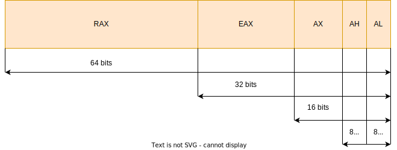

# The `x86_64` concepts

Some days ago I wrote the first post about [Introduction to assembly](https://github.com/0xAX/asm/blob/master/content/asm_1.md) which, to my surprise, caused great interest:


It motivated me to continue describing my journey through learning assembly programming for Linux x86_64. During these days I got great feedback from people all over the Internet. There were many words of gratitude, but, what is more important to me, there was also much adequate advice and very useful criticism. Especially, I want to say thank you for the great feedback to:

- [Fiennes](https://reddit.com/user/Fiennes)
- [Grienders](https://disqus.com/by/Universal178/)
- [nkurz](https://news.ycombinator.com/user?id=nkurz)

I also want to say thank you to all who took part in the discussion on [reddit](https://www.reddit.com/r/programming/comments/2exmpu/say_hello_to_assembly_part_1_linux_x8464/). There were many different opinions, some of them saying that the first post was not so clear for an absolute beginner. These comments inspired me to rework the first post and make some things more clear, keeping in mind that the main goal was just an introduction without diving too deep. For the future, I will try my best to write more informative posts.

So, let's start with the second part of learning assembly programming where I will try to bring closer the basic `x86_64` concepts.

## Terminology and concepts

Now that we've successfully written and run our first assembly program, it's time to learn the basics. Let's start with some terminology and concepts that we will see and use from now on.

### Processor registers

One of the first concepts we met in the previous post was a **register**. We agreed that we can consider a register as a small memory slot. Following the definition on [Wikipedia](https://en.wikipedia.org/wiki/Processor_register), we can see that it's not so far from truth:

> A processor register is a quickly accessible location available to a computer's processor.

The main goal of a processor is data processing. To process data, a processor must access this data somewhere. Of course, a processor can get data from [main memory](https://en.wikipedia.org/wiki/Random-access_memory), but it is a very slow operation. If we take a look at the [Latency Numbers Every Programmer Should Know](https://samwho.dev/numbers), we can see the following picture:

```
L1 cache reference = 1ns
...
...
...
Main memory reference = 100ns
```

Access to the [L1 CPU cache](https://en.wikipedia.org/wiki/CPU_cache) is `100x` times faster than access to the main memory. The processor registers are even "closer" to the processor. For comparison, you can take a look at the list of latencies for different instructions by [Agner Fog](https://www.agner.org/optimize/#manual_instr_tab).

There are different types of registers on the `x86_64` processors:

- General purpose registers
- Segment registers
- RFLAGS registers
- Control registers
- Model-specific registers
- Debug registers
- x87 FPU registers
- MMX registers
- XMM registers
- YMM registers
- ZMM registers
- Bounds registers
- Memory management registers

You can find a detailed description of registers in the [Intel software developer manuals](https://www.intel.com/content/www/us/en/developer/articles/technical/intel-sdm.html). For now, we will focus only on the **general purpose registers** as we will use them in most examples. If we will use other registers, I will mention it beforehand. We already saw a table with general purpose registers in the [previous chapter](https://github.com/0xAX/asm/blob/master/content/asm_1.md#cpu-registers-and-system-calls):


There are 16 registers of 64 bits size, from `rax` to `r15`. Each register also has smaller parts with their own names. For example, as we may see in the table above, the lower 32 bits of the `rax` register are called `eax`. Similarly, the lower 16 bits of the `eax` register are called `ax`. Finally, the lower 8 bits of the `ax` register are called `al`, while the higher 8 bits are called `ah`. We can visualize this as:



The general purpose registers are used in many different cases, like performing arithmetic and logical operations, transferring data, memory address calculation operations, passing parameters to functions and system calls, and many more. When going through these chapters, we will see how to use the general purpose registers to perform different operations.

### Endianness

A computer operates with bytes of data. The bytes can be stored in memory in different order. The order in which a computer stores a sequence of bytes is called **endianness**. There are two types of endianness:

- `big`
- `little`

We can imagine memory as one large array of bytes, where each byte has its own unique address. For example, let's say we have the following four bytes in memory: `AA 56 AB FF`. In the `little-endian` order, the least significant byte is stored at the smallest memory address:

| Address            | Byte |
|--------------------|------|
| 0x0000000000000000 | 0xFF |
| 0x0000000000000001 | 0xAB |
| 0x0000000000000002 | 0x56 |
| 0x0000000000000003 | 0xAA |

In the case of the `big-endian` order, the bytes are stored in the opposite order, so the most significant byte is stored at the smallest memory address:

| Address            | Byte |
|--------------------|------|
| 0x0000000000000000 | 0xAA |
| 0x0000000000000001 | 0x56 |
| 0x0000000000000002 | 0xAB |
| 0x0000000000000003 | 0xFF |

### System calls

A [system call](https://en.wikipedia.org/wiki/System_call) is a set of APIs provided by an operating system. A user-level program can use these APIs to achieve different functionalities that an operating system kernel provides. As mentioned in the previous [chapter](https://github.com/0xAX/asm/blob/master/content/asm_1.md#cpu-registers-and-system-calls), you can find all the system calls of the Linux kernel for the `x86_64` architecture [here](https://github.com/torvalds/linux/blob/master/arch/x86/entry/syscalls/syscall_64.tbl).

There are two ways to execute a system call:

- Using a library function like [printf](https://man7.org/linux/man-pages/man3/fprintf.3.html), which internally calls the OS-level API 
- Making a system call directly using the `syscall` instruction

To call a system call directly, we must prepare the parameters of this function. As we saw in the previous post, some general purpose registers were used for that. The rules that define how the system calls and functions are called and how their parameters are passed are called **calling conventions**. For the Linux `x86_64`, the calling conventions are specified in the [System V Application Binary Interface](https://refspecs.linuxbase.org/elf/x86_64-abi-0.99.pdf) PDF document.

Let's take a closer look at how arguments are passed to a system call if we trigger a system call using the `syscall` instruction.

The first six parameters are passed in the following general purpose registers:

- `rdi` - used to pass the first argument to a function.
- `rsi` - used to pass the second argument to a function.
- `rdx` - used to pass the third argument to a function.
- `r10` - used to pass the fourth argument to a function.
- `r8` - used to pass the fifth argument to a function.
- `r9` - used to pass the sixth argument to a function.

If we use a user-level wrapper instead of calling a system call directly, the order of registers and parameters will be different. For now, let's focus only on the calling conventions of the system calls using the Linux kernel interface. The system call number is passed in the `rax` register. Once we set up all the parameters in their respective registers, we can call the system call with the instruction `syscall`. After the system call is finished, the result is returned in the `rax` register.

### Program sections

As we saw in the first post, each program consists of program sections (or segments). Each executable file on Linux x86_64 is represented in the [ELF](https://en.wikipedia.org/wiki/Executable_and_Linkable_Format) format. An ELF file has a table of sections that a program consists of. We can see a list of sections in our `hello` program from the previous post using the [readelf](https://man7.org/linux/man-pages/man1/readelf.1.html) utility:

```
~$ strip hello && readelf -S hello

There are 4 section headers, starting at offset 0x2028:

Section Headers:
  [Nr] Name              Type             Address           Offset
       Size              EntSize          Flags  Link  Info  Align
  [ 0]                   NULL             0000000000000000  00000000
       0000000000000000  0000000000000000           0     0     0
  [ 1] .text             PROGBITS         0000000000401000  00001000
       0000000000000027  0000000000000000  AX       0     0     16
  [ 2] .data             PROGBITS         0000000000402000  00002000
       000000000000000d  0000000000000000  WA       0     0     4
  [ 3] .shstrtab         STRTAB           0000000000000000  0000200d
       0000000000000017  0000000000000000           0     0     1
Key to Flags:
  W (write), A (alloc), X (execute), M (merge), S (strings), I (info),
  L (link order), O (extra OS processing required), G (group), T (TLS),
  C (compressed), x (unknown), o (OS specific), E (exclude),
  D (mbind), l (large), p (processor specific)
```

As we can see, there are four sections. Two of them (`text` and `data`) were defined by us while writing the assembly code. The remaining two sections were added automatically by the compiler. While we can technically define any section in our program, there are some well-known, commonly used sections:

- `data` - used for declaring initialized data or constants.
- `bss` - used for declaring non-initialized variables.
- `text` - used for the code of the program.
- `shstrtab` - stores references to the existing sections.

### Data types

Assembly is not a [statically typed programming language](https://en.wikipedia.org/wiki/Category:Statically_typed_programming_languages). Usually, we work directly with a raw set of bytes. However, [NASM](https://nasm.us/) provides us with some helpers to define the size of data we are operating. The fundamental data types are:

- `byte` - 8 bits
- `word` - 2 bytes
- `doubleword` - 4 bytes
- `quadword` - 8 bytes

A byte is eight bits, a word is two bytes, a doubleword is four bytes, and a quadword is eight bytes. NASM provides pseudo-instructions to help us define the size:

- `DB` - `byte` - 8 bits
- `DW` - `word` - 2 bytes
- `DD` - `doubleword` - 4 bytes
- `DQ` - `quadword` - 8 bytes
- `DT` - 10 bytes
- `DO` - 16 bytes
- `DY` - 32 bytes
- `DZ` - 64 bytes

The pseudo-instructions from `DB` to `DQ` are used to define data with the size from `byte` to `quadword`. Additionally, `DT` is used to define 10 bytes, `DO` is used to define 16 bytes, `DY` is used to define 32 bytes, and `DZ` is used to define 64 bytes. 

For example:

```assembly
section .data
    ;; Define a byte with the value 100
    num1   db 100
    ;; Define 2 bytes with the value 1024
    num2   dw 1024
    ;; Define a set of characters (10 is a new line symbol in ASCII \n)
    msg    db "Sum is correct", 10
```

There are also alternatives to define uninitialized storage - `RESB`, `RESW`, `RESD`, `RESQ`, `REST`, `RESO`, `RESY`, and `RESZ`. These are used similarly to `DB` - `DZ`, but in this case, we do not provide an initial value for the defined variable.

For example:

```assembly
section .bss
    ;; Define a buffer with the size 64 bytes
    buffer resb 64
```

After defining variables, we can start using them in our program's code. To use a variable, we can refer it by name. However, there is a small thing to remember in the NASM assembly syntax: accessing a variable by name gets us its address, not the actual value it stores:

```assembly
;; Move the address of the `num1` variable to the al register
move al, num1
```

To get the actual value located in the given address, we need to specify the variable name in square brackets:

```assembly
;; Move the value of num1 to the al register
mov al, [num1]
```

### Stack

We can not dive into assembly programming without understanding one of the crucial concepts of the `x86_64` (and other) architectures — the [stack](https://en.wikipedia.org/wiki/Stack_(abstract_data_type)). The stack is a specific memory area in a program that is accessed in a last-in, first-out (LIFO) pattern.

A processor has a very limited number of registers. As we already know, an `x86_64` processor provides access to only 16 general purpose registers. Often, we may need more – or even much more space – to store data. One way to solve this issue is by using the program's stack. We can look at the stack as the usual memory area but with one significant difference – its access pattern.

In the usual [RAM](https://en.wikipedia.org/wiki/Random-access_memory) model, we can access any byte of memory accessible to our user-level application. However, the stack is accessed using a last-in, first-out (LIFO) pattern. Two specific instructions are used to interact with the stack: one to push a value into it and another to pop a value from it:

- `push` - pushes the operand into the stack.
- `pop` - pops the top value from the stack.

The stack grows downwards, from higher memory addresses to lower ones. So, when we refer to `top of the stack`, we actually mean the memory location with the lowest address in the current stack. In other words, the top of the stack is a pointer to the element with the lowest address. The general purpose register `rsp` should point to the top of the stack. 

In the [system call](#system-call) section, we saw that the first six arguments of a system call are passed in the general purpose registers. According to the calling conventions document:

> System-calls are limited to six arguments, no argument is passed directly on the stack.

So the available number of general purpose registers should be enough to execute any system call. But what about other functions? What if one has more than six arguments? In this case, the first six parameters are also passed in general purpose registers and all the next parameters are passed on the stack. The set of general purpose registers to call a library function is slightly different from the set of registers used for a system call:

- `rdi` - used to pass the first argument to a function.
- `rsi` - used to pass the second argument to a function.
- `rdx` - used to pass the third argument to a function.
- `rcx` - used to pass the fourth argument to a function.
- `r8` - used to pass the fifth argument to a function.
- `r9` - used to pass the sixth argument to a function.

Let’s take a look at the simple code example written in the C programming language to better illustrate the topic:

```C
int foo(int arg1, int arg2, int arg3, int arg4, int arg5, int arg6, int arg7, int arg8) {
    return arg1 + arg2 + arg3 + arg4 + arg5 + arg6 + arg7 + arg8;
}

int bar() {
    return foo(1, 2, 3, 4, 5, 6, 7, 8);
}
```

If we compile it and look at the assembly code, we will see such an output of the program:

```assembly
bar:
        ;; Preserve the base pointer
        push    rbp
        ;; Preserve the stack pointer
        mov     rbp, rsp
        ;; Push the eight argument on the stack
        push    8
        ;; Push the seventh argument on the stack
        push    7
        ;; Push the sixth argument on the stack
        mov     r9d, 6
        ;; Push the fifth argument on the stack
        mov     r8d, 5
        ;; Push the fourth argument on the stack
        mov     ecx, 4
        ;; Push the third argument on the stack
        mov     edx, 3
        ;; Push the second argument on the stack
        mov     esi, 2
        ;; Push the first argument on the stack
        mov     edi, 1
        ;; Call the function `foo`
        call    foo
        ;; Clean up the stack from the 8th and 7th arguments
        add     rsp, 16
        ;; Restore the old rbp
        leave
        ;; Return from the function
        ret
foo:
        ;; Preserve the base pointer
        push    rbp
        ;; Preserve the stack pointer
        mov     rbp, rsp
        ;; Move 4 bytes value from the edi register to the address stored in the rbp register minus 4 bytes offset
        mov     DWORD PTR [rbp-4], edi
        ;; Move 4 bytes value from the esi register to the address stored in the rbp register minus 8 bytes offset
        mov     DWORD PTR [rbp-8], esi
        ;; Move 4 bytes value from the edx register to the address stored in the rbp register minus 12 bytes offset
        mov     DWORD PTR [rbp-12], edx
        ;; Move 4 bytes value from the ecx register to the address stored in the rbp register minus 16 bytes offset
        mov     DWORD PTR [rbp-16], ecx
        ;; Move 4 bytes value from the r8d register to the address stored in the rbp register minus 20 bytes offset
        mov     DWORD PTR [rbp-20], r8d
        ;; Move 4 bytes value from the r9d register to the address stored in the rbp register minus 24 bytes offset
        mov     DWORD PTR [rbp-24], r9d
        ...
        ... # Skip arithmetic operations for now
        ...
        ;; Restore the old rbp
        pop     rbp
        ;; Return from the function
        ret
```

> [!NOTE]
> The C program should be compiled without any optimization flags because the compiler may eliminate all the calculations and just calculate the sum of arguments in compile time. You can use `-O0 -masm=intel` flags for the compiler to avoid optimization. You can use tools like [godbolt](https://godbolt.org/) to see the assembly output of these functions.

First of all, let's take a look at the first two lines of code in the function `bar`:

```assembly
push    rbp
mov     rbp, rsp
```

These two instructions at the beginning of each function are called [function prologue](https://en.wikipedia.org/wiki/Function_prologue_and_epilogue#Prologue). Each function usually operates with a part of the stack. Such a part is called a [stack frame](https://en.wikipedia.org/wiki/Call_stack). To manage the stack, the CPU uses these general purpose registers:

- `rip` - this register is the so-called `instruction pointer`. It stores the address of the next instruction the CPU is going to execute. When the CPU meets the `call` instruction to call a function, it pushes the address of the next instruction to run after the function call to the stack. This is done so the CPU knows where to continue the program's execution after the function call.
- `rsp` - this register is called a `stack pointer` and should point to the top of the stack. After we push something to the stack using the `push` instruction, the stack pointer address decreases. After we pop something from the stack using the `pop` instruction, the stack pointer address increases.
- `rbp` - this register is the so-called `frame pointer` or `base pointer` that points to the stack frame. As mentioned above, each function has its own stack frame, which is a memory area where the function stores [local variables](https://en.wikipedia.org/wiki/Local_variable) and other data.

Now that we know the rough meaning of the stack frame and the usage of the `rbp`, `rsp`, and `rip` registers, let's try to understand what happens when we call a function. Let's look at the stack before the `call foo` is executed. Our stack looks like this:


After executing the `call` instruction, the return address (or address of the next instruction) is pushed to the stack. So our stack layout during the call looks like this:


At the beginning of every new function, we must preserve the current value of the `rbp` register by pushing it onto the stack. This value acts as a base pointer of the previous function. In other words, the value of the `rbp` at the beginning of each function represents the address of the bottom (or the base) of the caller's stack. Since we are in a new function, it needs a new stack frame and, as a result, a new base. At this point, the stack layout looks like this:


The next step is to put the current value of the stack pointer (`rsp`) into the `rbp` register. This marks the beginning of the new stack frame for our function `foo`. With the stack frame ready, we can start managing function parameters and local variables.

The first six parameters of the `foo` function are passed using general purpose registers in the function `bar`. The eighth and seventh parameters of `foo` are pushed into the stack using `push` instructions within `bar`. Note that the eighth and seventh arguments are pushed into the stack in a specific order - the value `8` is pushed first, followed by `7`. As mentioned above, the stack operates with the `last in, first out` pattern. So if we use the `pop` instruction right after pushing these two values, we'd get `7` first, followed by `8`.

For calculations, we need to access the input parameters. This is done using the address stored in the `rbp` register and offsets from this address. These offsets are negative because the stack grows down towards lower memory addresses. At first, we move the value stored in the `edi` register (the first argument of the `foo` function) to the address stored in the `rbp` register with the `-4` bytes offset. Similarly, we move the value stored in the `esi` register (the second argument) to the address stored in the `rbp` register with the `-8` bytes offset. We repeat this operation for all six input arguments.

Let's read once again the sentence from the paragraph above:

> For calculations, we need to access the input parameters. This is done using the address stored in the `rbp` register and offsets from this address.

What was the address stored in the `rbp` register? Our stack pointer! So after running the last `mov` instruction in the function `foo`, our stack frame looks like this:


That is the whole point of the `rbp` register. It plays the role of an anchor or a base point in the function. Using the positive offsets, we can access the return address and parameters pushed onto the stack by the caller. On the other hand, negative offsets allow us to access local variables of the current function.

Right before returning from the `foo` function, we encounter the so-called [function epilogue](https://en.wikipedia.org/wiki/Function_prologue_and_epilogue#Epilogue). During this step, we restore the initial value of `rbp` by removing it from the stack. Finally, the last `ret` instruction pops the return address from the stack, and the program's execution continues from this address.

## Example

Now that we've covered the key concepts, it's time to move on to the most interesting part — writing our second simple assembly program. The program will take two integer numbers, calculate their sum, and compare the result with a third predefined number. If the predefined number is equal to the sum, the program will print a message on the screen; otherwise, it will just exit.

Before diving into the code, we must understand how to execute basic arithmetic and comparison instructions.

### Basic arithmetic instructions

Here is the list of common assembly instructions used for arithmetic operations:

- `ADD`  - Addition
- `SUB`  - Subtraction
- `MUL`  - Unsigned multiplication
- `IMUL` - Signed multiplication
- `DIV`  - Unsigned division
- `IDIV` - Signed division
- `INC`  - Increment
- `DEC`  - Decrement
- `NEG`  - Negateation

We will use these instructions and explain the details in the following example.

### Basic control flow

Now let's take a look at our first [control flow](https://en.wikipedia.org/wiki/Control_flow) instructions. Usually, programming languages allow you to change the order of evaluation (for example with `if`, `case`, or `goto` statements). The assembly programming language also provides the basic ability to change the flow of our programs. The first such instruction is `cmp`. This instruction takes two values and compares them. Usually, it is used along with the conditional jump instruction. For example:

```assembly
;; Compare the value of the rax register with 50
cmp rax, 50
```

The `cmp` instruction only compares the parameters without affecting their values. To perform any actions after the comparison, you can use **conditional jump instructions**:

-  `JE/JZ`  - Jump if the values are equal.
-  `JNE` - Jump if the values are not equal.
-  `JNZ` - Jump if the difference between two values is not zero.
-  `JG`  - Jump if the first value is greater than the second.
-  `JGE` - Jump if the first value is greater or equal to the second.
-  `JA`  - The same as `JG`, but performs the unsigned comparison.
-  `JAE` - The same as `JGE`, but performs the unsigned comparison.

For example, let's take the following `if/else` statement written in C:

```C
if (rax != 50) {
    foo();
} else {
    bar();
}
```

When translated to assembly, this statement looks like this:

```assembly
;; Compare rax with 50
cmp rax, 50
;; Jump to the label `.foo` if the value of the `rax` register is not equal to 50
jne .foo
;; Jump to the label `.bar` otherwise
jmp .bar
```

In addition, we can jump to a label without any conditions using the `jmp` instruction:

```assembly
jmp .label
```

Unconditional jumps are often used to simulate loops in assembly programming. For example, a label is placed at the beginning of a code block. The code runs, and then a condition is checked. If the condition isn't met, the program jumps back to the label and repeats the code. The topic of loops will be covered in more detail in the next posts.

### Program example

Now that we've covered basic arithmetic and control flow instructions, we can write a simple program. As a reminder, this program will calculate the sum of two integers and compare it to a predefined third number. If the sum equals the third number, a string will be printed; otherwise, the program will just exit.

Here is the source code of our example:

```assembly
;; Definition of the .data section
section .data
    ;; The first number
    num1 dq 0x64
    ;; The second number
    num2 dq 0x32
    ;; The message to print if the sum is correct
    msg  db "The sum is correct!", 10

;; Definition of the .text section
section .text
    ;; Reference to the entry point of our program
    global _start

;; Entry point
_start:
    ;; Set the value of num1 to rax
    mov rax, [num1]
    ;; Set the value of num2 to rbx
    mov rbx, [num2]
    ;; Get the sum of rax and rbx. The result is stored in rax.
    add rax, rbx
.compare:
    ;; Compare the rax value with 150
    cmp rax, 150
    ;; Go to the .exit label if the rax value is not 150
    jne .exit
    ;; Go to the .correctSum label if the rax value is 150
    jmp .correctSum

;; Print a message that the sum is correct
.correctSum:
    ;; Specify the system call number (1 is `sys_write`).
    mov rax, 1
    ;; Set the first argument of `sys_write` to 1 (`stdout`).
    mov rdi, 1
    ;; Set the second argument of `sys_write` to the reference of the `msg` variable.        
    mov rsi, msg
    ;; Set the third argument to the length of the `msg` variable's value (20 bytes).
    mov rdx, 20
    ;; Call the `sys_write` system call.
    syscall
    ;; Go to the exit of the program.
    jmp .exit

;; Exit procedure
.exit:
    ;; Specify the number of the system call (60 is `sys_exit`).
    mov rax, 60
    ;; Set the first argument of `sys_exit` to 0. The 0 status code is success.
    mov rdi, 0
    ;; Call the `sys_exit` system call.
    syscall
```

First, let's build our program using the commands we learned in the previous chapter to see the result:

```bash
$ nasm -f elf64 -o program.o program.asm
$ ld -o program program.o
```

After building the program, we can run it with:

```bash
~$ ./program
Sum is correct
```

Now let's go through the source code of our program. First of all, there is the `.data` section with three variables:

- `num1`
- `num2`
- `msg`

The entry point of our program is the `_start` symbol. At the beginning of the source code, we put the values of `num1` and `num2` to the general purpose registers `rax` and `rbx`. Then, we use the `add` instruction to calculate their sum, which will be stored in the `rax` register.

Based on our program's description, the next step is to compare the sum of the two numbers with the predefined value. We use the `cmp` instruction for this. At this point, there are two possible outcomes:

- If the value in the `rax` register (which stores the sum of `num1` and `num2`) is not equal to 150, we jump to the `.exit` label.
- If the sum is equal to 150, we jump to the `.correctSum` label.

The source code of both `.correctSum` and `.exit` sub-routines should look familiar, as they are similar to what we covered in the previous chapter. The `.correctSum` sub-routine prints the string from `msg` to the screen, while the `.exit` sub-routine ensures a graceful exit from the program.

We’ve just written our second program — great job 🎉 In the next post, we’ll continue exploring assembly programming and dive deeper into the stack topic. If you have any questions or thoughts, feel free to reach out. See you in the next post!
